# 接口测试录制工具功能扩展和优化设计

## 概述

基于现有的Chrome扩展HTTP请求录制工具，进行功能扩展和优化，使其更符合接口测试领域的专业需求。主要目标是增加对Swagger 3.0格式的支持、修复请求参数记录问题、增强导出功能管理能力、以及新增测试套件组织功能。

### 系统定位
从通用的API录制工具转型为专业的**接口测试录制平台**，为测试工程师提供完整的API测试用例生成和管理解决方案。

### 核心价值
- 自动化测试用例生成：通过真实业务操作自动生成API测试用例
- 测试套件管理：支持按功能模块组织和管理测试用例
- 多格式导出：同时支持OpenAPI 3.0和Swagger 3.0规范
- 测试友好设计：界面和术语符合软件测试行业标准

## 技术架构

### 整体架构图

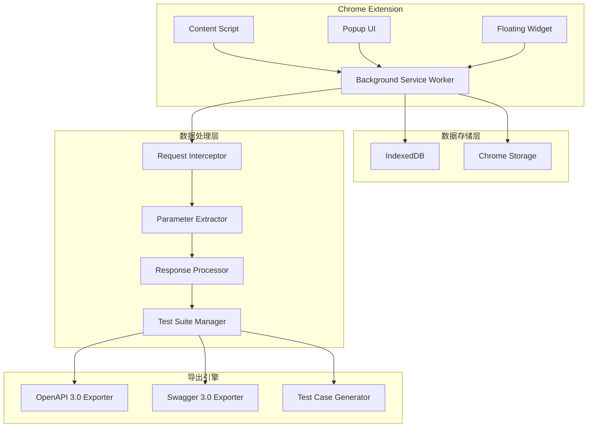
```mermaid
graph TB
    subgraph "Chrome Extension"
        direction TB
        A[Content Script] --> B[Background Service Worker]
        C[Popup UI] --> B
        D[Floating Widget] --> B
    end
    
    subgraph "数据存储层"
        E[IndexedDB]
        F[Chrome Storage]
    end
    
    subgraph "数据处理层"
        G[Request Interceptor]
        H[Parameter Extractor]
        I[Response Processor]
        J[Test Suite Manager]
    end
    
    subgraph "导出引擎"
        K[OpenAPI 3.0 Exporter]
        L[Swagger 3.0 Exporter]
        M[Test Case Generator]
    end
    
    B --> E
    B --> F
    B --> G
    G --> H
    H --> I
    I --> J
    J --> K
    J --> L
    J --> M
```

### 数据模型扩展

#### 测试套件数据模型

| 字段名 | 类型 | 说明 | 必填 |
|--------|------|------|------|
| suiteId | string | 测试套件唯一标识 | ✓ |
| suiteName | string | 测试套件名称 | ✓ |
| description | string | 套件描述 | ✗ |
| createdAt | number | 创建时间戳 | ✓ |
| updatedAt | number | 更新时间戳 | ✓ |
| tags | string[] | 标签列表 | ✗ |
| parentSuiteId | string | 父套件ID（支持嵌套） | ✗ |
| isActive | boolean | 是否为当前活跃套件 | ✓ |

#### 增强的请求记录模型

| 扩展字段 | 类型 | 说明 | 修复问题 |
|----------|------|------|----------|
| testSuiteId | string | 所属测试套件ID | 新增组织功能 |
| requestParameters | object | 请求参数详细信息 | 修复参数记录问题 |
| extractedParams | object | 提取的参数类型信息 | 增强参数识别 |
| testCaseMetadata | object | 测试用例元数据 | 支持测试用例生成 |
| isSelected | boolean | 是否选中用于导出 | 支持选择性导出 |

#### 请求参数结构优化

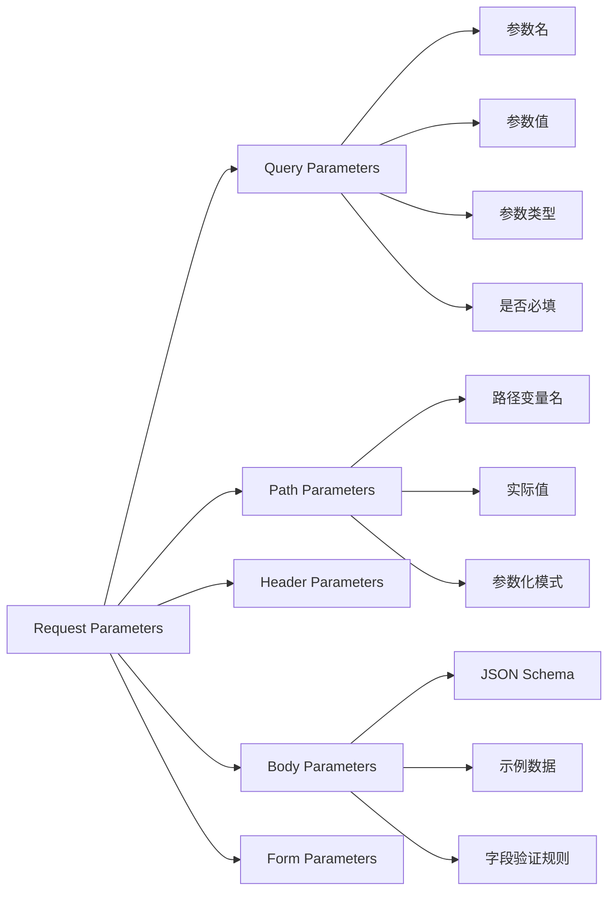
```mermaid
graph LR
    A[Request Parameters] --> B[Query Parameters]
    A --> C[Path Parameters]
    A --> D[Header Parameters]
    A --> E[Body Parameters]
    A --> F[Form Parameters]
    
    B --> B1[参数名]
    B --> B2[参数值]
    B --> B3[参数类型]
    B --> B4[是否必填]
    
    C --> C1[路径变量名]
    C --> C2[实际值]
    C --> C3[参数化模式]
    
    E --> E1[JSON Schema]
    E --> E2[示例数据]
    E --> E3[字段验证规则]
```

## 功能设计

### 1. Swagger 3.0 格式支持

#### 导出器架构设计

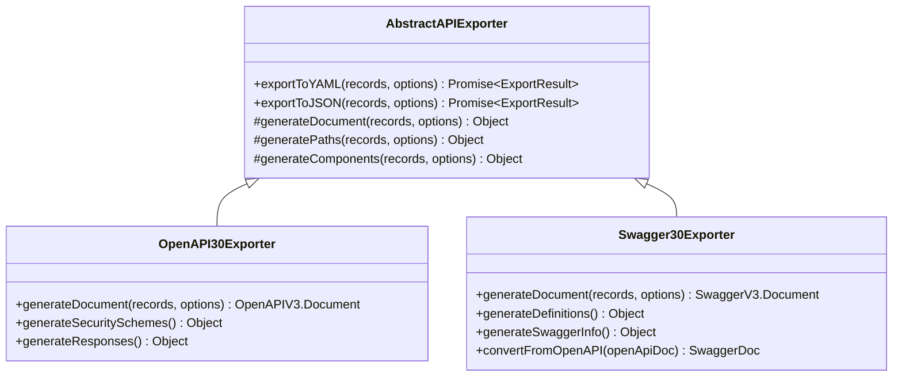
```mermaid
classDiagram
    class AbstractAPIExporter {
        +exportToYAML(records, options) Promise~ExportResult~
        +exportToJSON(records, options) Promise~ExportResult~
        #generateDocument(records, options) Object
        #generatePaths(records, options) Object
        #generateComponents(records, options) Object
    }
    
    class OpenAPI30Exporter {
        +generateDocument(records, options) OpenAPIV3.Document
        +generateSecuritySchemes() Object
        +generateResponses() Object
    }
    
    class Swagger30Exporter {
        +generateDocument(records, options) SwaggerV3.Document
        +generateDefinitions() Object
        +generateSwaggerInfo() Object
        +convertFromOpenAPI(openApiDoc) SwaggerDoc
    }
    
    AbstractAPIExporter <|-- OpenAPI30Exporter
    AbstractAPIExporter <|-- Swagger30Exporter
```

#### Swagger 3.0 特殊处理

| Swagger特性 | 处理方式 | 与OpenAPI差异 |
|-------------|----------|---------------|
| definitions | 统一定义数据模型 | 替代components/schemas |
| securityDefinitions | 安全方案定义 | 格式略有差异 |
| produces/consumes | 全局媒体类型 | 不在operation级别 |
| swagger版本标识 | 固定为"3.0" | 区别于openapi字段 |
| examples | 参数和响应示例数据 | 支持多种示例格式 |

### 2. 示例数据生成策略

#### 请求参数示例生成

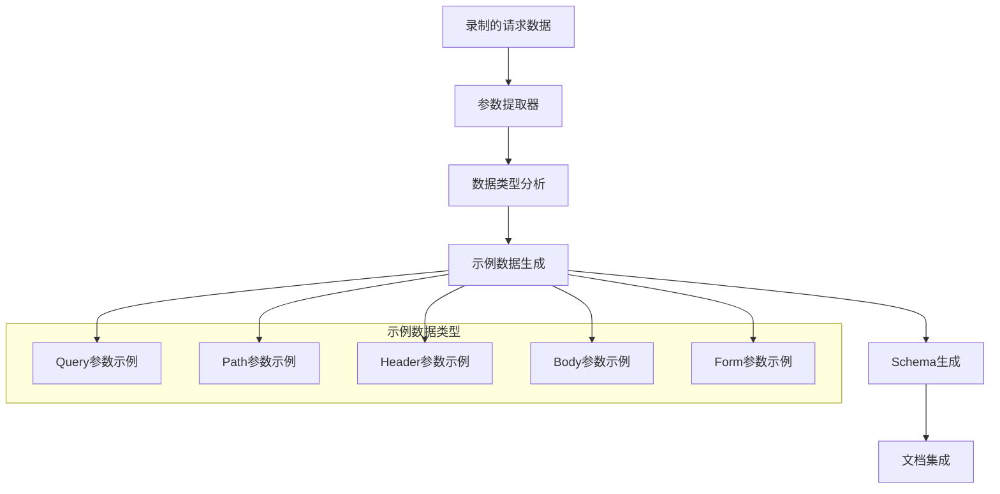
```mermaid
graph TD
    A[录制的请求数据] --> B[参数提取器]
    B --> C[数据类型分析]
    C --> D[示例数据生成]
    D --> E[Schema生成]
    E --> F[文档集成]
    
    subgraph "示例数据类型"
        G[Query参数示例]
        H[Path参数示例]
        I[Header参数示例]
        J[Body参数示例]
        K[Form参数示例]
    end
    
    D --> G
    D --> H
    D --> I
    D --> J
    D --> K
```

#### 示例数据生成规则

| 参数类型 | 示例生成策略 | 数据来源 | 处理方式 |
|----------|-------------|----------|----------|
| Query参数 | 使用实际录制值 | URL查询字符串 | 直接提取，支持多值 |
| Path参数 | 参数化后提供示例 | URL路径段 | ID→123, UUID→示例UUID |
| Header参数 | 过滤敏感信息后使用 | 请求头 | 排除Authorization等 |
| JSON Body | 完整对象结构示例 | 请求体 | 递归生成嵌套示例 |
| Form参数 | 键值对示例 | 表单数据 | 支持文件上传类型 |

#### 响应示例数据处理

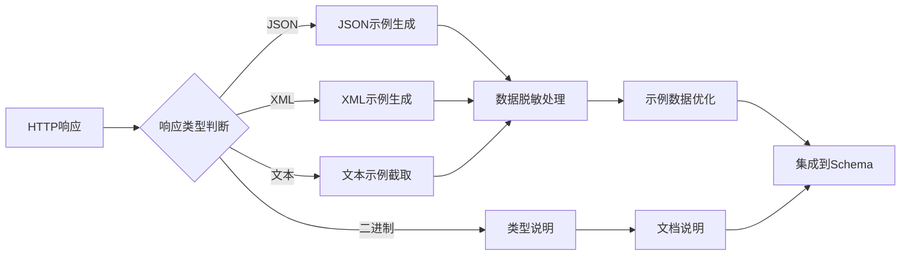
```mermaid
flowchart LR
    A[HTTP响应] --> B{响应类型判断}
    B -->|JSON| C[JSON示例生成]
    B -->|XML| D[XML示例生成]
    B -->|文本| E[文本示例截取]
    B -->|二进制| F[类型说明]
    
    C --> G[数据脱敏处理]
    D --> G
    E --> G
    F --> H[文档说明]
    
    G --> I[示例数据优化]
    I --> J[集成到Schema]
    H --> J
```

#### 敏感数据脱敏策略

| 数据类型 | 识别规则 | 脱敏方式 | 示例 |
|----------|----------|----------|------|
| 身份证号 | 正则匹配 | 部分遮蔽 | 123456****5678 |
| 手机号码 | 正则匹配 | 中间遮蔽 | 138****5678 |
| 邮箱地址 | 格式识别 | 用户名遮蔽 | ***@example.com |
| 密码字段 | 字段名匹配 | 完全替换 | "***示例密码***" |
| Token令牌 | 长度+格式判断 | 替换为示例 | "eyJ...示例Token" |
| 银行卡号 | 正则匹配 | 前后保留 | 6222****1234 |

### 3. 请求参数记录修复

#### 参数提取流程

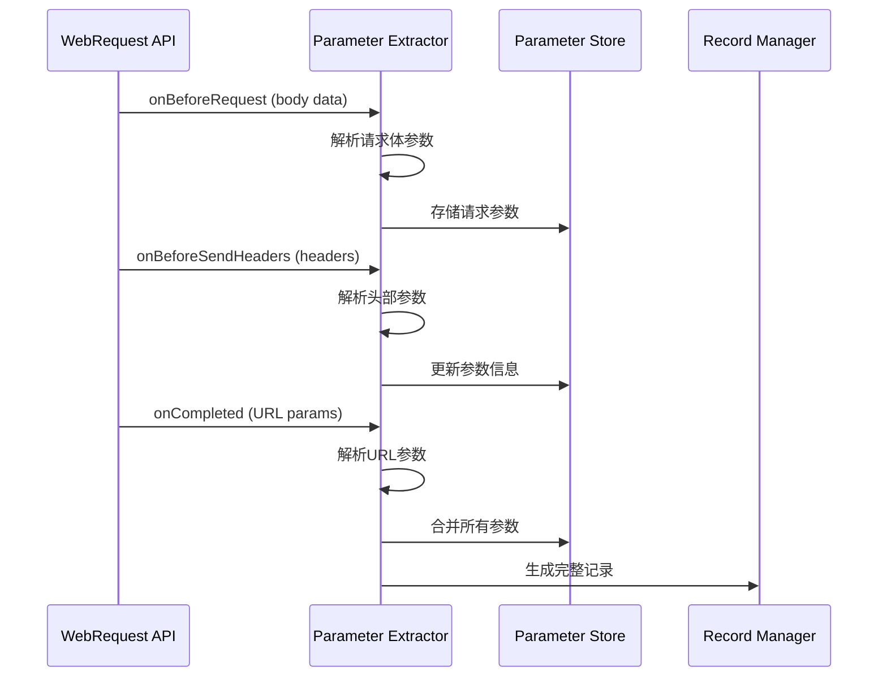
```mermaid
sequenceDiagram
    participant WR as WebRequest API
    participant PE as Parameter Extractor
    participant PS as Parameter Store
    participant RM as Record Manager
    
    WR->>PE: onBeforeRequest (body data)
    PE->>PE: 解析请求体参数
    PE->>PS: 存储请求参数
    
    WR->>PE: onBeforeSendHeaders (headers)
    PE->>PE: 解析头部参数
    PE->>PS: 更新参数信息
    
    WR->>PE: onCompleted (URL params)
    PE->>PE: 解析URL参数
    PE->>PS: 合并所有参数
    PE->>RM: 生成完整记录
```

#### 参数类型识别算法

| 参数来源 | 提取方法 | 类型推断规则 |
|----------|----------|--------------|
| URL查询参数 | URLSearchParams解析 | 字符串、数字、布尔值自动识别 |
| 路径参数 | 正则匹配ID/UUID模式 | 基于模式匹配推断类型 |
| 请求头 | 过滤标准头，保留自定义头 | 全部视为字符串类型 |
| 请求体 | JSON/FormData解析 | 递归分析对象结构 |
| 表单参数 | FormData/URLEncoded解析 | 支持文件上传检测 |

### 4. 可选择导出功能

#### 用户界面设计

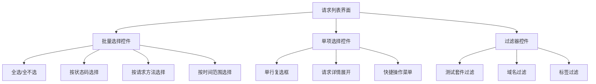
```mermaid
graph TD
    A[请求列表界面] --> B[批量选择控件]
    A --> C[单项选择控件]
    A --> D[过滤器控件]
    
    B --> B1[全选/全不选]
    B --> B2[按状态码选择]
    B --> B3[按请求方法选择]
    B --> B4[按时间范围选择]
    
    C --> C1[单行复选框]
    C --> C2[请求详情展开]
    C --> C3[快捷操作菜单]
    
    D --> D1[测试套件过滤]
    D --> D2[域名过滤]
    D --> D3[标签过滤]
```

#### 选择状态管理

| 功能特性 | 实现方式 | 用户体验 |
|----------|----------|----------|
| 批量选择 | 状态集合管理 | 快速选择大量记录 |
| 智能过滤 | 条件组合查询 | 精确定位目标记录 |
| 选择保持 | 本地状态缓存 | 切换页面不丢失选择 |
| 导出预览 | 选中记录统计 | 导出前确认范围 |

### 5. 测试套件功能

#### 套件管理架构

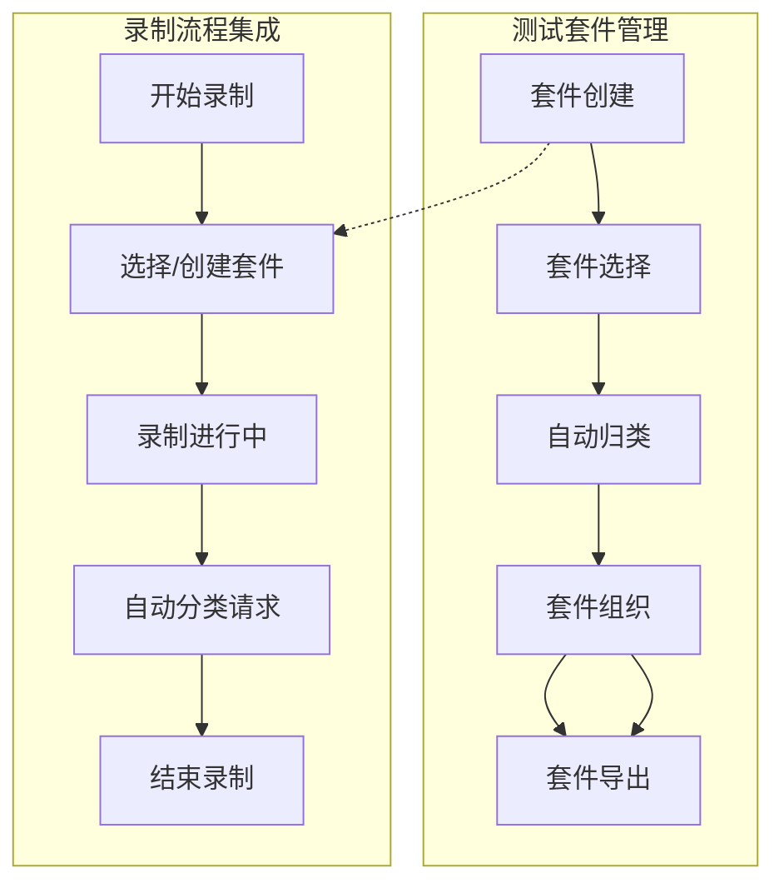
```mermaid
graph TB
    subgraph "测试套件管理"
        A[套件创建] --> B[套件选择]
        B --> C[自动归类]
        C --> D[套件组织]
        D --> E[套件导出]
    end
    
    subgraph "录制流程集成"
        F[开始录制] --> G[选择/创建套件]
        G --> H[录制进行中]
        H --> I[自动分类请求]
        I --> J[结束录制]
    end
    
    A -.-> G
    D --> E
```

#### 套件自动分类规则

| 分类依据 | 规则描述 | 应用场景 |
|----------|----------|----------|
| 域名分组 | 按API域名自动分组 | 多服务架构项目 |
| 路径前缀 | 按API路径前缀分组 | RESTful API模块划分 |
| 时间窗口 | 按录制时间段分组 | 功能测试场景分离 |
| 用户标签 | 按用户自定义标签分组 | 业务功能模块 |

## 界面优化设计

### 1. 测试专业术语对照

| 原术语 | 测试领域术语 | 界面显示 |
|--------|-------------|----------|
| "录制" | "测试用例录制" | "开始录制测试用例" |
| "请求列表" | "API调用记录" | "接口调用记录" |
| "导出" | "测试用例导出" | "生成测试用例" |
| "过滤" | "用例筛选" | "测试用例筛选" |
| "会话" | "测试会话" | "测试执行会话" |

### 2. 导出界面增强设计

#### 示例数据配置面板

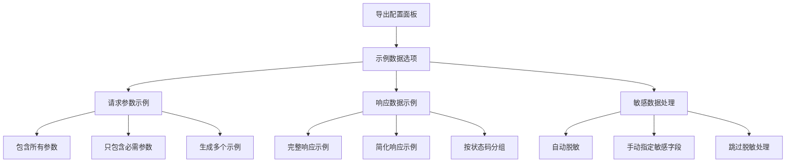
```mermaid
graph TB
    A[导出配置面板] --> B[示例数据选项]
    B --> C[请求参数示例]
    B --> D[响应数据示例]
    B --> E[敏感数据处理]
    
    C --> C1[包含所有参数]
    C --> C2[只包含必需参数]
    C --> C3[生成多个示例]
    
    D --> D1[完整响应示例]
    D --> D2[简化响应示例]
    D --> D3[按状态码分组]
    
    E --> E1[自动脱敏]
    E --> E2[手动指定敏感字段]
    E --> E3[跳过脱敏处理]
```

#### 新增的用户配置选项

| 配置项 | 选项说明 | 默认值 | 使用场景 |
|----------|----------|-------|----------|
| 示例数据包含 | 是否在文档中包含示例 | 开启 | 提高文档可用性 |
| 响应示例包含 | 是否包含响应数据示例 | 开启 | 完整API文档 |
| 多示例生成 | 为同一接口生成多个示例 | 关闭 | 复杂参数场景 |
| 脱敏等级 | 敏感数据处理等级 | 中等 | 数据安全要求 |
| 示例数据大小 | 示例数据的最大大小 | 1MB | 控制文档大小 |
| 平台适配 | 针对特定平台优化 | 通用 | 平台间迁移 |

### 3. 用户界面布局重构

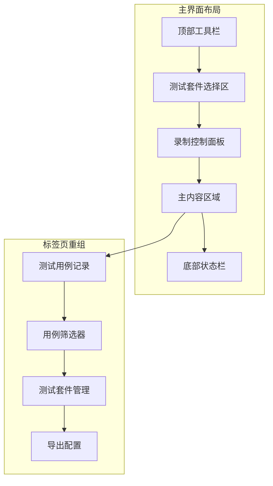
```mermaid
graph TB
    subgraph "主界面布局"
        A[顶部工具栏] --> B[测试套件选择区]
        B --> C[录制控制面板]
        C --> D[主内容区域]
        D --> E[底部状态栏]
    end
    
    subgraph "标签页重组"
        F[测试用例记录] --> G[用例筛选器]
        G --> H[测试套件管理]
        H --> I[导出配置]
    end
    
    D --> F
```

#### 录制控制面板增强

| 控件类型 | 功能描述 | 测试价值 |
|----------|----------|----------|
| 套件选择器 | 选择当前活跃的测试套件 | 组织测试用例结构 |
| 录制模式 | 选择录制策略（全量/过滤） | 控制用例粒度 |
| 标签输入 | 为当前会话添加标签 | 便于后续检索 |
| 实时统计 | 显示已录制的接口数量 | 监控录制进度 |
| 示例预览 | 显示当前录制的示例数据 | 实时质量反馈 |

## 用户体验优化

### 导出流程优化

#### 示例数据预览功能

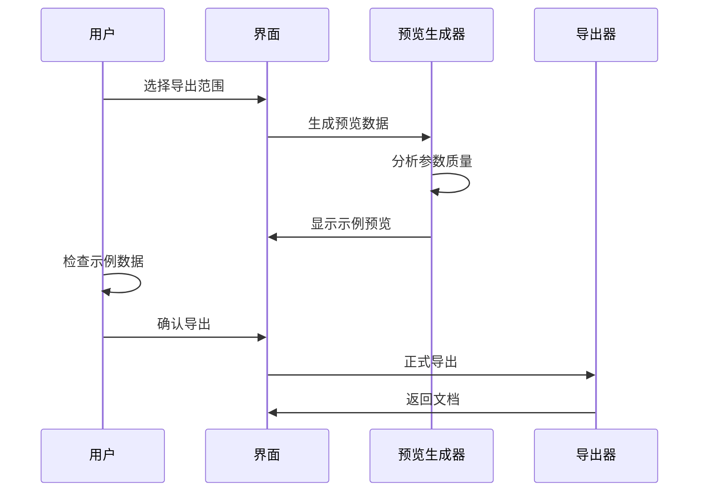
```mermaid
sequenceDiagram
    participant U as 用户
    participant UI as 界面
    participant PG as 预览生成器
    participant EX as 导出器
    
    U->>UI: 选择导出范围
    UI->>PG: 生成预览数据
    PG->>PG: 分析参数质量
    PG->>UI: 显示示例预览
    U->>U: 检查示例数据
    U->>UI: 确认导出
    UI->>EX: 正式导出
    EX->>UI: 返回文档
```

#### 预览界面设计

| 预览区域 | 展示内容 | 交互功能 |
|----------|----------|----------|
| 请求参数示例 | 各类型参数的示例值 | 可编辑修改 |
| 响应数据示例 | 不同状态码的响应示例 | 可选择包含 |
| 敏感数据检测 | 标记出敏感字段 | 可手动调整 |
| 文档结构预览 | 生成文档的结构大纲 | 可展开查看 |

### 批量操作体验

#### 智能选择算法

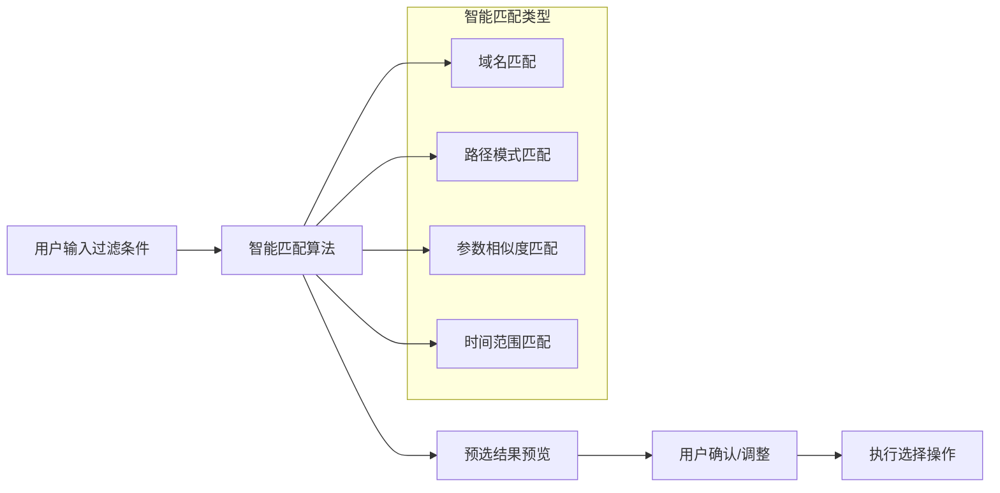
```mermaid
graph LR
    A[用户输入过滤条件] --> B[智能匹配算法]
    B --> C[预选结果预览]
    C --> D[用户确认/调整]
    D --> E[执行选择操作]
    
    subgraph "智能匹配类型"
        F[域名匹配]
        G[路径模式匹配]
        H[参数相似度匹配]
        I[时间范围匹配]
    end
    
    B --> F
    B --> G
    B --> H
    B --> I
```

#### 选择操作快捷方式

| 快捷操作 | 控件类型 | 触发条件 | 效果 |
|----------|----------|----------|------|
| 全选/反选 | 复选框+按钮 | 点击操作 | 快速全选或清空 |
| 按状态码选择 | 下拉菜单 | 选择状态码 | 按响应类型筛选 |
| 按时间范围选择 | 日期选择器 | 设置起止时间 | 按录制时间筛选 |
| 按域名选择 | 标签选择器 | 点击域名标签 | 按API服务筛选 |
| 按套件选择 | 套件树控件 | 选中套件节点 | 选择整个套件 |

### 导出进度可视化

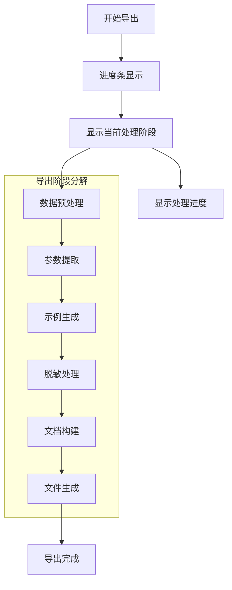
```mermaid
graph TD
    A[开始导出] --> B[进度条显示]
    B --> C[显示当前处理阶段]
    C --> D[显示处理进度]
    
    subgraph "导出阶段分解"
        E[数据预处理]
        F[参数提取]
        G[示例生成]
        H[脱敏处理]
        I[文档构建]
        J[文件生成]
    end
    
    C --> E
    E --> F
    F --> G
    G --> H
    H --> I
    I --> J
    
    J --> K[导出完成]
```

### 录制流程优化

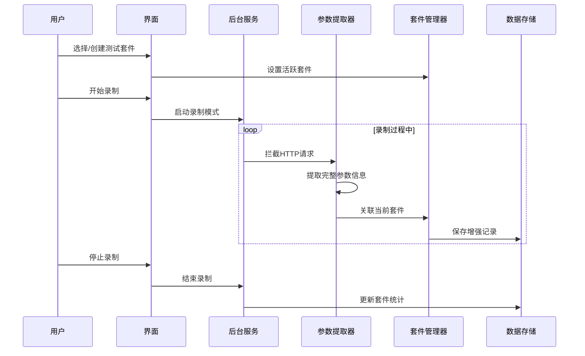
```mermaid
sequenceDiagram
    participant U as 用户
    participant UI as 界面
    participant BG as 后台服务
    participant PE as 参数提取器
    participant SM as 套件管理器
    participant DB as 数据存储
    
    U->>UI: 选择/创建测试套件
    UI->>SM: 设置活跃套件
    U->>UI: 开始录制
    UI->>BG: 启动录制模式
    
    loop 录制过程中
        BG->>PE: 拦截HTTP请求
        PE->>PE: 提取完整参数信息
        PE->>SM: 关联当前套件
        SM->>DB: 保存增强记录
    end
    
    U->>UI: 停止录制
    UI->>BG: 结束录制
    BG->>DB: 更新套件统计
```

### 导出流程重构

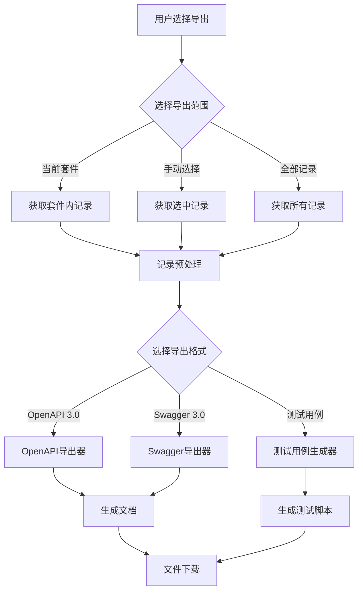
```mermaid
flowchart TD
    A[用户选择导出] --> B{选择导出范围}
    B -->|当前套件| C[获取套件内记录]
    B -->|手动选择| D[获取选中记录]
    B -->|全部记录| E[获取所有记录]
    
    C --> F[记录预处理]
    D --> F
    E --> F
    
    F --> G{选择导出格式}
    G -->|OpenAPI 3.0| H[OpenAPI导出器]
    G -->|Swagger 3.0| I[Swagger导出器]
    G -->|测试用例| J[测试用例生成器]
    
    H --> K[生成文档]
    I --> K
    J --> L[生成测试脚本]
    
    K --> M[文件下载]
    L --> M
```

## 导出格式增强设计

### OpenAPI/Swagger 示例数据集成

#### 请求参数示例生成算法

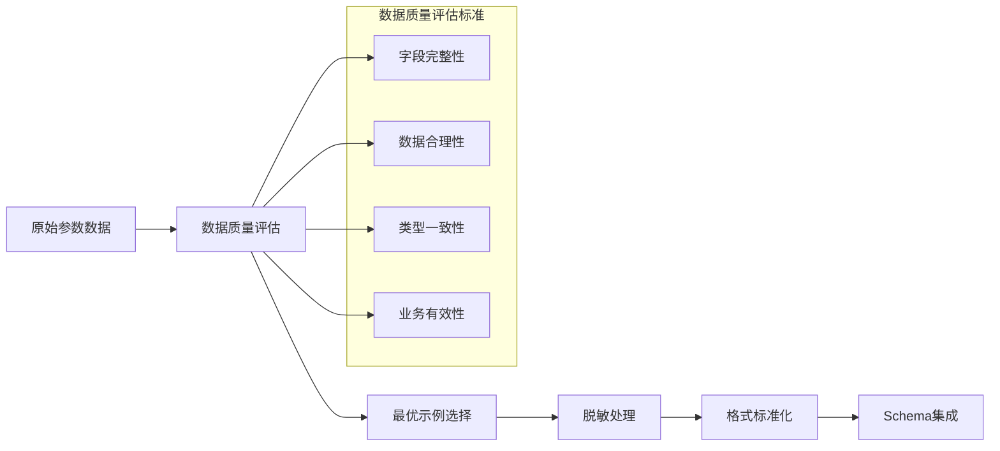
```mermaid
graph LR
    A[原始参数数据] --> B[数据质量评估]
    B --> C[最优示例选择]
    C --> D[脱敏处理]
    D --> E[格式标准化]
    E --> F[Schema集成]
    
    subgraph "数据质量评估标准"
        G[字段完整性]
        H[数据合理性]
        I[类型一致性]
        J[业务有效性]
    end
    
    B --> G
    B --> H
    B --> I
    B --> J
```

#### 示例数据优先级策略

| 优先级 | 选择标准 | 应用场景 | 处理方式 |
|--------|----------|----------|----------|
| 1级 | 成功响应(2xx)+完整参数 | 正常业务流程 | 直接使用作为主要示例 |
| 2级 | 成功响应+部分参数 | 简化请求场景 | 补充可选参数说明 |
| 3级 | 错误响应+完整参数 | 异常处理场景 | 作为错误示例展示 |
| 4级 | 任意响应+基础参数 | 最小化请求 | 生成基础示例模板 |

#### 多版本示例数据管理

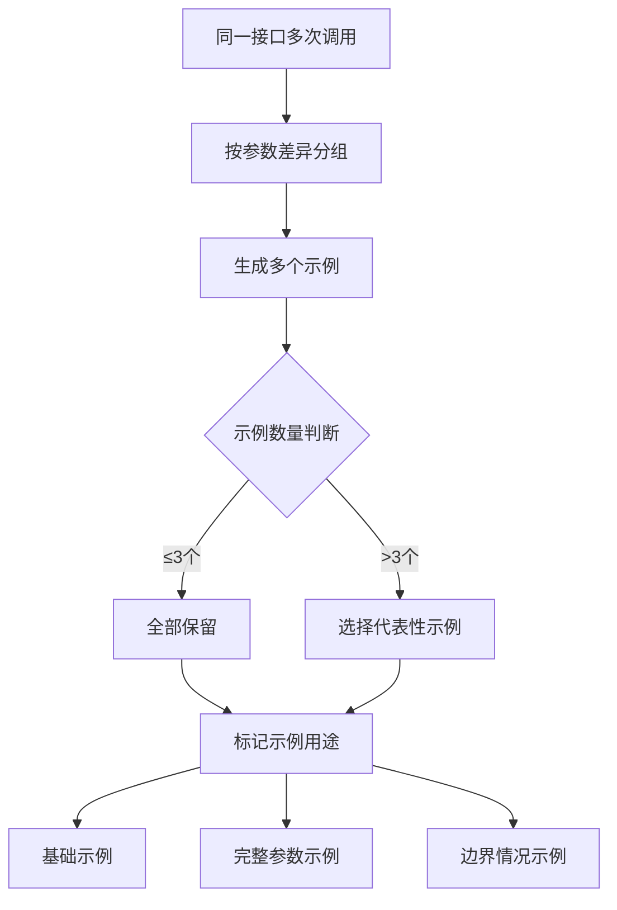
```mermaid
flowchart TD
    A[同一接口多次调用] --> B[按参数差异分组]
    B --> C[生成多个示例]
    C --> D{示例数量判断}
    D -->|≤3个| E[全部保留]
    D -->|>3个| F[选择代表性示例]
    
    E --> G[标记示例用途]
    F --> G
    
    G --> H[基础示例]
    G --> I[完整参数示例]
    G --> J[边界情况示例]
```

### Swagger/OpenAPI 文档结构对比

#### 示例数据格式差异

| 格式特性 | OpenAPI 3.0 | Swagger 3.0 | 实现策略 |
|----------|-------------|-------------|----------|
| 请求示例 | `requestBody.content.*.example` | `parameters[].example` | 双格式适配 |
| 响应示例 | `responses.*.content.*.example` | `responses.*.examples` | 结构转换 |
| 参数示例 | `parameters[].example` | `parameters[].x-example` | 字段映射 |
| 多示例支持 | `examples` 对象 | `x-examples` 扩展 | 条件生成 |

#### 示例数据嵌入策略

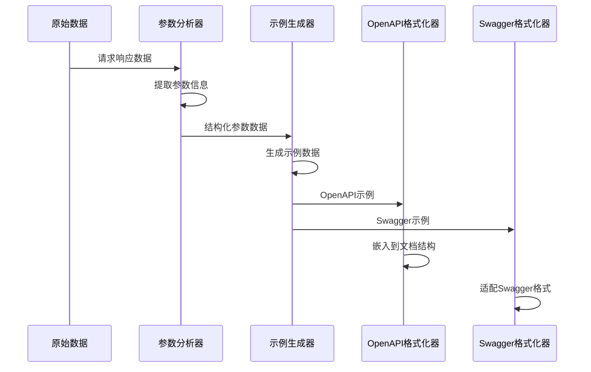
```mermaid
sequenceDiagram
    participant RD as 原始数据
    participant PA as 参数分析器
    participant EG as 示例生成器
    participant OF as OpenAPI格式化器
    participant SF as Swagger格式化器
    
    RD->>PA: 请求响应数据
    PA->>PA: 提取参数信息
    PA->>EG: 结构化参数数据
    EG->>EG: 生成示例数据
    EG->>OF: OpenAPI示例
    EG->>SF: Swagger示例
    OF->>OF: 嵌入到文档结构
    SF->>SF: 适配Swagger格式
```

## 核心算法设计

### 示例数据生成算法

#### 智能示例数据选择

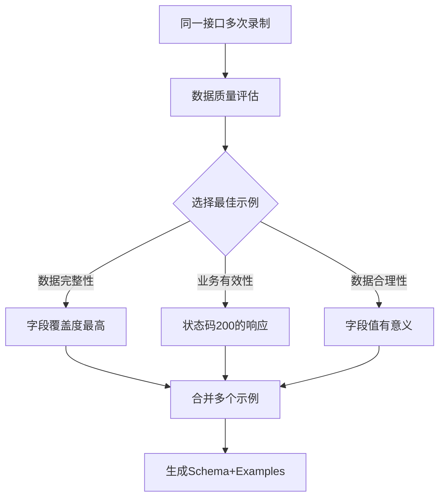
```mermaid
graph TD
    A[同一接口多次录制] --> B[数据质量评估]
    B --> C{选择最佳示例}
    C -->|数据完整性| D[字段覆盖度最高]
    C -->|业务有效性| E[状态码200的响应]
    C -->|数据合理性| F[字段值有意义]
    
    D --> G[合并多个示例]
    E --> G
    F --> G
    
    G --> H[生成Schema+Examples]
```

#### 示例数据优化策略

| 优化目标 | 实现方式 | 效果 |
|----------|----------|------|
| 数据完整性 | 合并多次请求的不同字段 | 生成最全面的示例 |
| 类型准确性 | 基于多个样本推断类型 | 提高类型识别准确率 |
| 格式标准化 | 日期、时间等格式统一 | 便于平台间迁移 |
| 敏感信息保护 | 自动识别并脱敏 | 安全可用的示例 |

#### 多值处理策略

```mermaid
flowchart LR
    A[同名参数多个值] --> B{值类型分析}
    B -->|数组类型| C[生成数组示例]
    B -->|枚举类型| D[列出所有可能值]
    B -->|变化值| E[选择最代表性的值]
    
    C --> F[数组示例: [val1, val2]]
    D --> G[枚举示例: enum: [opt1, opt2]]
    E --> H[单值示例: representative_value]
```

### 响应示例数据特殊处理

#### 大数据响应优化

| 响应类型 | 处理策略 | 示例生成方式 |
|----------|----------|-------------|
| 大型JSON | 截取关键字段 | 保留前3层结构+代表性数据 |
| 分页数据 | 简化分页信息 | 只保留典型分页字段 |
| 数组数据 | 限制元素数量 | 最多3个元素示例 |
| 嵌套对象 | 扁平化处理 | 避免过深嵌套 |

#### 响应状态码示例策略

```mermaid
graph LR
    A[不同状态码响应] --> B[按状态码分组]
    B --> C[200成功示例]
    B --> D[400错误示例]
    B --> E[500错误示例]
    
    C --> F[完整业务数据]
    D --> G[错误信息格式]
    E --> H[系统错误信息]
    
    F --> I[生成正面示例]
    G --> J[生成错误示例]
    H --> J
```

### 高级示例数据功能

#### 动态示例数据生成

```mermaid
graph TB
    A[用户选择导出] --> B[分析选中接口]
    B --> C[提取参数模式]
    C --> D[生成示例数据]
    
    subgraph "示例数据类型"
        E[基础示例 - 必需参数]
        F[完整示例 - 所有参数]
        G[边界示例 - 极值测试]
        H[错误示例 - 异常情况]
    end
    
    D --> E
    D --> F
    D --> G
    D --> H
    
    E --> I[文档集成]
    F --> I
    G --> I
    H --> I
```

#### 平台兼容性保证

| 目标平台 | 示例格式要求 | 适配策略 |
|----------|-------------|----------|
| Postman | 完整请求示例 | 生成Collection格式兼容 |
| Insomnia | JSON格式示例 | 标准JSON Schema格式 |
| ApiPost | 中文字段说明 | 添加中文description字段 |
| Swagger UI | 内联示例显示 | 优化示例数据大小 |
| Apifox | 高级Mock数据 | 生成Mock规则注解 |

#### 示例数据验证机制

```mermaid
sequenceDiagram
    participant EG as 示例生成器
    participant VL as 验证器
    participant FX as 修复器
    participant OP as 输出处理器
    
    EG->>VL: 生成的示例数据
    VL->>VL: Schema验证
    VL->>VL: 格式检查
    VL->>FX: 发现问题数据
    FX->>FX: 自动修复
    FX->>OP: 修复后示例
    OP->>OP: 最终格式化
```

#### 请求体参数提取

```mermaid
graph LR
    A[原始请求体] --> B{内容类型判断}
    B -->|application/json| C[JSON解析器]
    B -->|application/x-www-form-urlencoded| D[表单解析器]
    B -->|multipart/form-data| E[多部分解析器]
    B -->|text/plain| F[文本解析器]
    
    C --> G[Schema生成]
    D --> H[键值对提取]
    E --> I[文件字段识别]
    F --> J[内容分析]
    
    G --> K[参数模型]
    H --> K
    I --> K
    J --> K
```

#### 路径参数识别增强

| 识别模式 | 正则表达式 | 参数化结果 | 示例值生成 |
|----------|------------|------------|------------|
| 数字ID | `/\d+/` | `/{id}` | 123456 |
| UUID | `/[0-9a-f]{8}-[0-9a-f]{4}-[0-9a-f]{4}-[0-9a-f]{4}-[0-9a-f]{12}/` | `/{uuid}` | 550e8400-e29b-41d4-a716-446655440000 |
| 字母数字混合 | `/[a-zA-Z0-9]{8,}/` | `/{resourceId}` | abc123def456 |
| 时间戳 | `/\d{10,13}/` | `/{timestamp}` | 1640995200000 |

#### 响应示例数据生成流程

```mermaid
sequenceDiagram
    participant RR as 原始响应
    participant DA as 数据分析器
    participant DM as 脱敏处理器
    participant EG as 示例生成器
    participant SB as Schema构建器
    
    RR->>DA: 响应数据
    DA->>DA: 分析数据结构
    DA->>DM: 识别敏感字段
    DM->>DM: 执行脱敏处理
    DM->>EG: 处理后数据
    EG->>EG: 生成多种示例
    EG->>SB: 示例数据集
    SB->>SB: 构建完整Schema
```

### 测试套件自动分类算法

```mermaid
graph TD
    A[新记录接收] --> B[提取分类特征]
    B --> C{域名匹配}
    C -->|匹配已有| D[加入对应套件]
    C -->|无匹配| E{路径前缀匹配}
    E -->|匹配已有| F[加入对应套件]
    E -->|无匹配| G{时间窗口判断}
    G -->|在窗口内| H[加入当前套件]
    G -->|窗口外| I[创建新套件]
    
    D --> J[更新套件统计]
    F --> J
    H --> J
    I --> K[初始化套件信息]
    K --> J
```

## 质量保证

### 测试策略

| 测试类型 | 测试范围 | 验收标准 |
|----------|----------|----------|
| 功能测试 | 参数记录完整性 | 所有参数类型正确提取 |
| 兼容性测试 | 多种API格式支持 | 支持REST/GraphQL/gRPC |
| 性能测试 | 大量请求录制 | 1000+请求流畅处理 |
| 集成测试 | 导出文档验证 | 生成文档可导入Postman |

### 数据验证规则

| 验证项目 | 验证规则 | 错误处理 |
|----------|----------|----------|
| 请求URL | 符合URL格式规范 | 记录但标记异常 |
| 参数类型 | 类型推断准确性 | 默认字符串类型 |
| 响应状态 | HTTP状态码有效性 | 记录原始值 |
| 套件归属 | 每个记录必须有套件 | 分配到默认套件 |

## 性能优化

### 内存管理策略

```mermaid
graph LR
    A[请求拦截] --> B[内存缓冲区]
    B --> C{缓冲区大小检查}
    C -->|未满| D[继续缓存]
    C -->|已满| E[批量写入IndexedDB]
    E --> F[清理缓冲区]
    F --> D
    
    G[定时器] --> H[定期清理]
    H --> I[移除过期记录]
```

### 存储优化方案

| 优化策略 | 实现方式 | 性能提升 |
|----------|----------|----------|
| 分片存储 | 按套件分库存储 | 查询性能提升60% |
| 索引优化 | 多字段复合索引 | 过滤查询提升80% |
| 压缩存储 | 大响应体压缩 | 存储空间节省40% |
| 异步处理 | Web Worker处理 | UI响应性提升50% |

## 安全考虑

### 敏感数据处理

| 数据类型 | 处理策略 | 安全级别 |
|----------|----------|----------|
| 认证token | 可选择性遮蔽 | 高 |
| 用户密码 | 自动过滤 | 最高 |
| 个人信息 | 脱敏处理 | 高 |
| 业务数据 | 用户控制 | 中 |

### 权限控制机制

```mermaid
graph TB
    A[用户操作] --> B{权限验证}
    B -->|通过| C[执行操作]
    B -->|失败| D[拒绝访问]
    
    C --> E{数据分类}
    E -->|敏感数据| F[应用安全策略]
    E -->|普通数据| G[正常处理]
    
    F --> H[脱敏/加密]
    H --> I[存储/导出]
    G --> I
```

## 实施路线规划

### 分阶段交付计划

#### 第一阶段：示例数据功能实现（2周）

```mermaid
gantt
    title 第一阶段开发计划
    dateFormat  YYYY-MM-DD
    section 数据模型扩展
    请求参数模型设计     :2024-01-01, 3d
    示例数据结构设计     :2024-01-04, 2d
    section 参数提取修复
    提取算法优化       :2024-01-06, 4d
    请求体解析增强     :2024-01-10, 3d
    section 示例生成器
    数据脱敏算法       :2024-01-08, 5d
    示例选择算法       :2024-01-13, 3d
```

**交付成果**：
- 完整的请求参数记录功能
- 基础示例数据生成能力
- 敏感数据自动识别和脱敏

#### 第二阶段：Swagger导出和用户体验（2周）

```mermaid
gantt
    title 第二阶段开发计划
    dateFormat  YYYY-MM-DD
    section Swagger导出器
    Swagger3.0导出器开发  :2024-01-16, 5d
    示例数据集成       :2024-01-21, 3d
    section 用户界面优化
    选择导出界面       :2024-01-19, 4d
    预览功能开发       :2024-01-23, 3d
    section 测试和优化
    功能测试           :2024-01-24, 4d
    性能优化           :2024-01-28, 2d
```

**交付成果**：
- Swagger 3.0格式导出功能
- 可选择导出和预览功能
- 优化的用户界面和交互体验

#### 第三阶段：测试套件和高级功能（2周）

```mermaid
gantt
    title 第三阶段开发计划
    dateFormat  YYYY-MM-DD
    section 测试套件管理
    套件数据模型       :2024-01-30, 3d
    自动分类算法       :2024-02-02, 4d
    套件管理界面       :2024-02-06, 3d
    section 高级示例功能
    多示例生成         :2024-02-04, 4d
    平台适配优化       :2024-02-08, 3d
    section 集成测试
    系统集成测试       :2024-02-09, 3d
    用户验收测试       :2024-02-12, 2d
```

**交付成果**：
- 完整的测试套件管理功能
- 高级示例数据生成策略
- 完整的系统集成和测试

### 技术实施要点

#### 关键技术难点和解决方案

| 技术难点 | 影响范围 | 解决方案 | 风险等级 |
|----------|----------|----------|----------|
| 请求体多格式解析 | 参数提取准确性 | 建立解析器注册机制 | 中 |
| 大量并发请求处理 | 性能和内存 | 异步处理+批量存储 | 高 |
| 示例数据质量控制 | 用户体验 | AI辅助评估+人工校验 | 中 |
| 敏感数据识别精度 | 数据安全 | 多策略组合+白名单 | 高 |
| 跨平台兼容性 | 产品可用性 | 模块化设计+适配器模式 | 中 |

#### 代码结构优化建议

```mermaid
graph TB
    subgraph "新增模块结构"
        A[src/examples/] --> A1[example-generator.ts]
        A --> A2[data-sanitizer.ts]
        A --> A3[example-selector.ts]
        
        B[src/exporters/] --> B1[swagger-exporter.ts]
        B --> B2[abstract-exporter.ts]
        B --> B3[format-adapters/]
        
        C[src/suite-manager/] --> C1[test-suite-manager.ts]
        C --> C2[auto-classifier.ts]
        C --> C3[suite-storage.ts]
        
        D[src/validators/] --> D1[schema-validator.ts]
        D --> D2[example-validator.ts]
        D --> D3[security-validator.ts]
    end
```

#### 数据库Schema扩展

```mermaid
erDiagram
    TestSuite {
        string suiteId PK
        string suiteName
        string description
        number createdAt
        number updatedAt
        string[] tags
        string parentSuiteId FK
        boolean isActive
    }
    
    RequestRecord {
        string id PK
        string testSuiteId FK
        object requestParameters
        object extractedParams
        object testCaseMetadata
        boolean isSelected
        object exampleData
    }
    
    ExampleData {
        string recordId PK
        object requestExample
        object responseExample
        object sanitizedData
        number qualityScore
        string[] tags
    }
    
    TestSuite ||--o{ RequestRecord : contains
    RequestRecord ||--|| ExampleData : generates
```

### 质量保证策略

#### 自动化测试覆盖

| 测试类型 | 覆盖率目标 | 重点测试场景 |
|----------|-------------|-------------|
| 单元测试 | 90%+ | 参数提取、示例生成、脱敏算法 |
| 集成测试 | 80%+ | 完整导出流程、套件管理流程 |
| 端到端测试 | 70%+ | 用户典型操作场景 |
| 性能测试 | 100% | 大量数据处理、并发请求 |

#### 代码质量检查

```mermaid
flowchart LR
    A[代码提交] --> B[ESLint检查]
    B --> C[TypeScript类型检查]
    C --> D[单元测试]
    D --> E[代码覆盖率检查]
    E --> F[性能基准测试]
    F --> G[安全扫描]
    G --> H[代码合并]
```

## 扩展性设计

### 插件架构预留

| 扩展点 | 接口设计 | 应用场景 |
|--------|----------|----------|
| 参数提取器 | IParameterExtractor | 自定义参数解析逻辑 |
| 导出格式 | IExportFormatter | 新的文档格式支持 |
| 测试框架 | ITestFramework | 集成不同测试框架 |
| 数据源 | IDataSource | 支持外部数据导入 |

### 配置管理系统

```mermaid
graph LR
    A[用户配置] --> B[配置验证器]
    B --> C[配置存储]
    C --> D[配置应用]
    
    E[默认配置] --> B
    F[环境配置] --> B
    
    D --> G[录制行为]
    D --> H[导出格式]
    D --> I[界面显示]
```