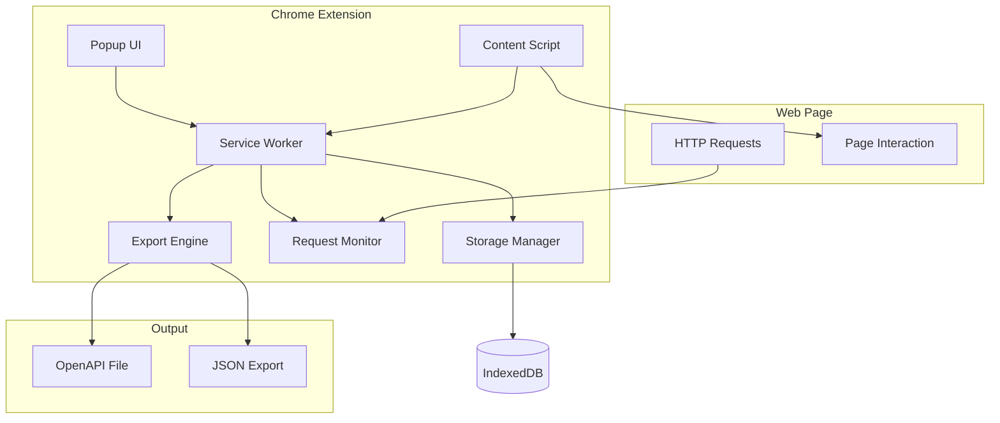
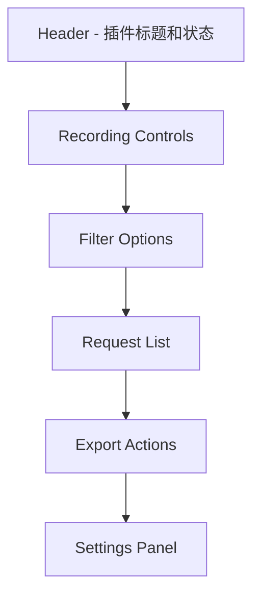
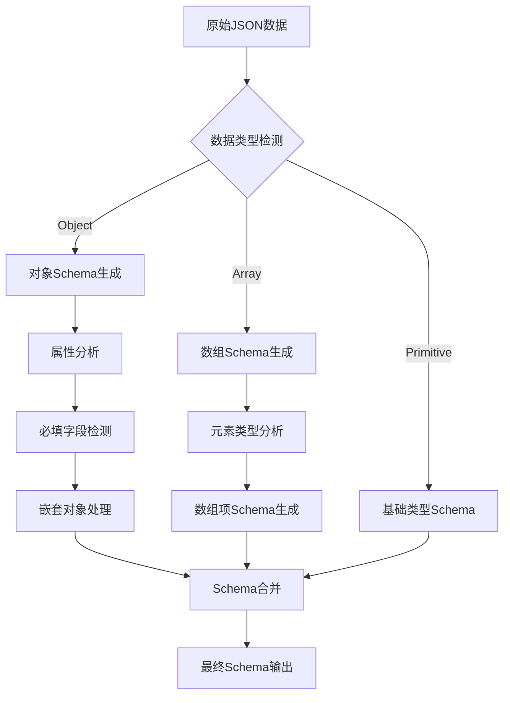
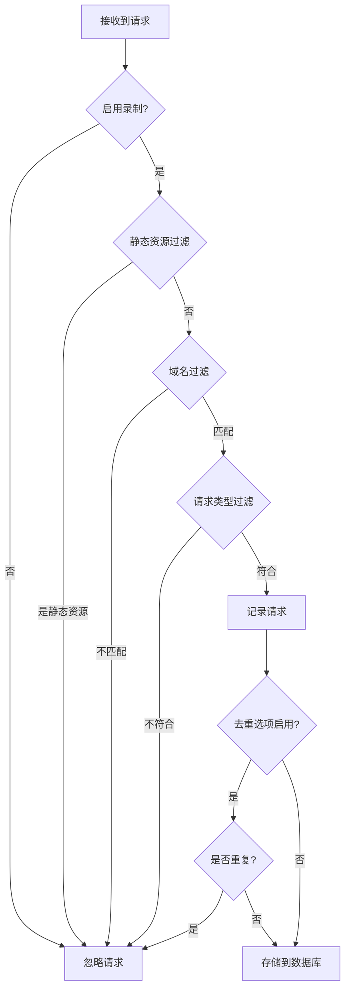
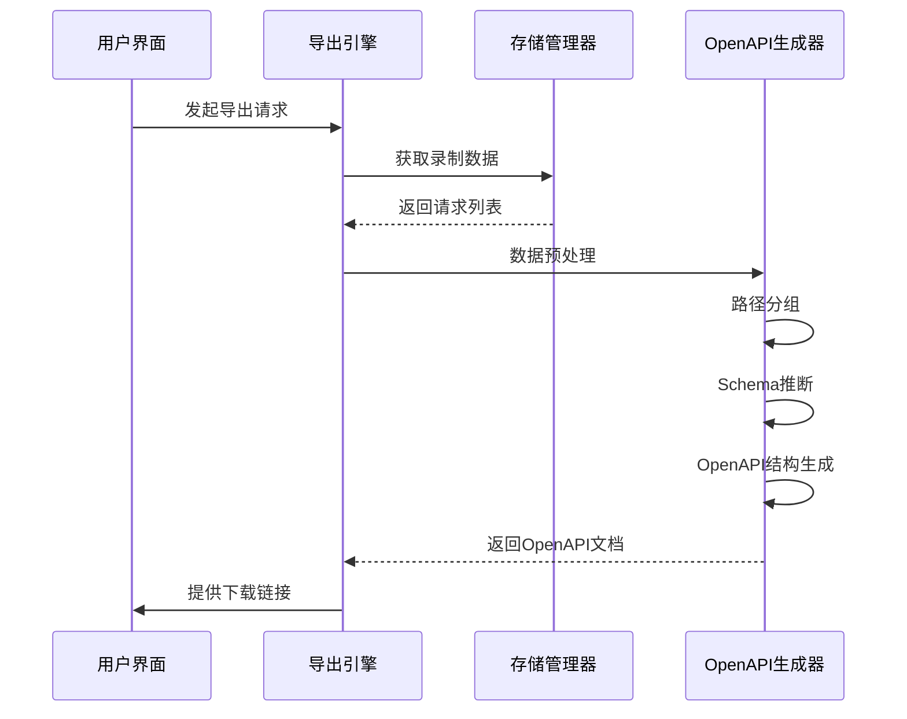

# 接口录制与导出插件设计文档

## 概述

本插件是一个Chrome浏览器扩展，专门用于录制用户浏览网页时产生的HTTP接口请求，并提供将录制数据导出为OpenAPI 3.0规范文件的功能。插件具备智能过滤、去重、数据管理等核心功能，为API文档生成和接口测试提供便利。

### 核心价值
- **自动化API文档生成**：无需手动整理接口文档，自动从实际请求中提取API信息
- **完整请求响应记录**：保留完整的请求参数和响应数据，便于后续分析
- **智能数据过滤**：自动排除静态资源请求，专注于业务接口
- **标准格式导出**：生成符合OpenAPI 3.0规范的文档，便于集成到现有工具链

## 技术栈与依赖

### 核心技术
- **Chrome Extension Manifest V3**：插件基础框架
- **Service Worker**：后台请求监听与数据处理
- **Content Script**：页面注入脚本
- **React + TypeScript**：用户界面开发
- **Tailwind CSS**：样式框架
- **IndexedDB**：本地数据存储

### 关键依赖库
- **openapi-types**：OpenAPI规范类型定义
- **js-yaml**：YAML格式处理
- **lodash**：工具函数库
- **date-fns**：日期处理

## 架构设计

### 整体架构



### 核心组件架构

#### 1. Service Worker (后台服务)
负责请求监听、数据处理和存储管理的核心组件。

**职责**：
- 监听所有HTTP请求和响应
- 过滤和分类请求类型
- 数据预处理和存储
- 与Popup UI通信

#### 2. Popup UI (用户界面)
提供用户交互的主要界面，支持录制控制和数据管理。

**主要功能**：
- 录制状态控制
- 请求列表查看
- 过滤选项设置
- 导出功能操作

#### 3. Content Script (内容脚本)
注入到目标页面的脚本，用于收集页面上下文信息。

**功能**：
- 获取页面标题和URL
- 监听页面路由变化
- 收集表单提交信息

#### 4. Storage Manager (存储管理器)
管理录制数据的本地存储和检索。

**存储策略**：
- 使用IndexedDB进行大容量数据存储
- 实现数据分页和索引优化
- 支持数据备份和恢复

#### 5. Export Engine (导出引擎)
将录制的请求数据转换为OpenAPI格式。

**转换流程**：
- 请求数据标准化
- Schema自动推断
- OpenAPI结构生成
- 格式验证和优化

## 用户界面设计

### 主界面布局



### 界面组件详细设计

#### 1. 录制控制区域
| 组件 | 功能 | 状态指示 |
|-----|------|----------|
| 录制按钮 | 开始/停止录制 | 红色(录制中)/灰色(已停止) |
| 清空按钮 | 清除所有录制数据 | 危险操作确认 |
| 计数器 | 显示已录制请求数量 | 实时更新 |

#### 2. 过滤选项区域
| 过滤类型 | 默认状态 | 描述 |
|---------|----------|------|
| 排除静态资源 | 开启 | 过滤图片、CSS、JS等资源 |
| 仅AJAX请求 | 开启 | 只录制XMLHttpRequest和Fetch |
| 排除重复接口 | 关闭 | 基于URL和方法去重 |
| 域名过滤 | 关闭 | 只录制指定域名请求 |

#### 3. 请求列表区域
采用虚拟滚动技术展示大量请求数据。

**列表项信息**：
- HTTP方法标签（GET/POST/PUT/DELETE）
- 请求URL（截断显示）
- 响应状态码
- 请求时间戳
- 响应时间
- 数据大小

#### 4. 导出操作区域
| 导出格式 | 文件扩展名 | 特性 |
|---------|-----------|------|
| OpenAPI YAML | .yaml | 标准格式，易读性好 |
| OpenAPI JSON | .json | 程序友好格式 |
| 原始数据 | .json | 完整的请求响应数据 |

## 数据模型设计

### 录制数据结构

#### RequestRecord (请求记录)
| 字段名 | 类型 | 描述 | 必填 |
|--------|------|------|------|
| id | string | 唯一标识符 | ✓ |
| timestamp | number | 请求时间戳 | ✓ |
| method | string | HTTP方法 | ✓ |
| url | string | 完整请求URL | ✓ |
| headers | object | 请求头信息 | ✓ |
| requestBody | any | 请求体数据 | ✗ |
| responseStatus | number | 响应状态码 | ✓ |
| responseHeaders | object | 响应头信息 | ✓ |
| responseBody | any | 响应体数据 | ✗ |
| responseTime | number | 响应时间(ms) | ✓ |
| pageUrl | string | 发起请求的页面URL | ✓ |
| pageTitle | string | 页面标题 | ✗ |

#### SessionMetadata (会话元数据)
| 字段名 | 类型 | 描述 |
|--------|------|------|
| sessionId | string | 会话标识 |
| startTime | number | 录制开始时间 |
| endTime | number | 录制结束时间 |
| totalRequests | number | 总请求数量 |
| filteredRequests | number | 过滤后请求数量 |
| targetDomains | string[] | 目标域名列表 |

### OpenAPI转换模型

#### PathItem生成规则
- **路径提取**：从URL中提取路径部分，参数化动态部分
- **参数推断**：分析查询参数和路径参数
- **Schema生成**：基于请求响应数据自动生成JSON Schema

#### Schema推断算法


## 业务逻辑层设计

### 请求监听与过滤

#### 监听策略
使用Chrome Extension的webRequest API监听所有HTTP请求：

**监听范围**：
- onBeforeRequest：捕获请求基本信息
- onBeforeSendHeaders：获取请求头信息
- onResponseStarted：获取响应状态和头信息
- onCompleted：获取完整响应数据

#### 过滤机制



### 数据去重算法

#### 重复判断维度
| 维度 | 权重 | 比较方法 |
|-----|------|----------|
| HTTP方法 | 高 | 精确匹配 |
| 路径部分 | 高 | 参数化后比较 |
| 查询参数结构 | 中 | 键名比较 |
| 请求体结构 | 中 | Schema比较 |
| 响应体结构 | 低 | Schema比较 |

#### 去重策略
- **保留最新**：相同接口保留最后一次请求
- **保留最完整**：保留参数最全的请求记录
- **智能合并**：合并多次请求的参数信息

### OpenAPI生成引擎

#### 转换流程



#### 生成配置选项
| 配置项 | 默认值 | 描述 |
|--------|--------|------|
| 版本号 | 3.0.3 | OpenAPI规范版本 |
| 服务器URL | 自动检测 | API服务器地址 |
| 标题 | 自动生成 | API文档标题 |
| 描述 | 可选 | API文档描述 |
| 参数化路径 | 启用 | 自动参数化动态路径 |
| 包含示例 | 启用 | 在Schema中包含示例数据 |

## 中间件与拦截器

### 请求拦截器链


#### 1. 域名过滤器
**功能**：根据用户配置过滤目标域名
**配置**：支持通配符和正则表达式匹配

#### 2. 资源类型过滤器
**功能**：排除静态资源请求
**过滤列表**：
- 图片文件：jpg, png, gif, svg, webp
- 样式文件：css, scss, less
- 脚本文件：js, ts, jsx, tsx
- 字体文件：woff, woff2, ttf, eot
- 媒体文件：mp4, mp3, avi, mov

#### 3. 重复检测器
**算法**：基于URL模式和参数结构的智能去重
**策略**：可配置保留策略（最新、最完整、全部保留）

#### 4. 数据标准化器
**功能**：统一数据格式，处理特殊字符和编码
**处理内容**：
- URL编码规范化
- JSON数据格式化
- 头信息标准化
- 时间戳统一格式

## 测试策略

### 单元测试覆盖

#### 核心模块测试
| 模块 | 测试重点 | 覆盖率目标 |
|-----|----------|-----------|
| 请求过滤器 | 过滤规则准确性 | 95% |
| 数据去重 | 去重算法有效性 | 90% |
| Schema推断 | 类型推断准确性 | 85% |
| OpenAPI生成 | 格式规范符合性 | 90% |
| 数据存储 | CRUD操作完整性 | 95% |

#### 测试数据准备
- **Mock请求数据**：涵盖各种HTTP方法和数据类型
- **边界情况**：大文件、特殊字符、异常响应
- **性能测试**：大量请求数据的处理能力

### 集成测试

#### 端到端测试场景
| 场景 | 描述 | 验证点 |
|-----|------|--------|
| 完整录制流程 | 从开始录制到导出文件 | 数据完整性 |
| 过滤功能验证 | 各种过滤选项的有效性 | 过滤准确性 |
| 大数据量处理 | 长时间录制和大量请求 | 性能稳定性 |
| 异常情况处理 | 网络错误、权限问题等 | 错误处理 |

### 性能测试

#### 性能指标
| 指标 | 目标值 | 测试场景 |
|-----|--------|----------|
| 内存使用 | < 50MB | 1000个请求录制 |
| 响应时间 | < 100ms | 单个请求处理 |
| 导出速度 | < 5秒 | 500个接口导出 |
| 存储效率 | < 1MB | 100个请求数据 |

## 配置与扩展点

### 用户配置选项

#### 录制设置
```yaml
recording:
  autoStart: false           # 自动开始录制
  maxRecords: 1000          # 最大录制数量
  retention: 7              # 数据保留天数
  domains:                  # 目标域名配置
    - "*.example.com"
    - "api.service.com"
```

#### 过滤设置
```yaml
filters:
  excludeStatic: true       # 排除静态资源
  ajaxOnly: true           # 仅AJAX请求
  duplicateRemoval: false   # 去重选项
  minResponseTime: 0       # 最小响应时间(ms)
  statusCodes:             # 状态码过滤
    - 200
    - 201
    - 400
    - 404
    - 500
```

#### 导出设置
```yaml
export:
  format: "yaml"           # 默认导出格式
  includeExamples: true    # 包含示例数据
  parameterizeUrls: true   # 参数化URL
  serverUrl: "auto"        # 服务器URL设置
  apiInfo:                 # API信息
    title: "Recorded API"
    version: "1.0.0"
    description: ""
```

### 扩展接口

#### 插件扩展点
| 扩展点 | 接口 | 用途 |
|--------|------|------|
| 自定义过滤器 | FilterPlugin | 添加自定义过滤逻辑 |
| 数据处理器 | DataProcessor | 自定义数据处理 |
| 导出格式 | ExportFormatter | 支持新的导出格式 |
| UI组件 | UIComponent | 自定义界面组件 |

#### 第三方集成
- **Postman集成**：导出为Postman Collection格式
- **Swagger UI**：直接在浏览器中预览API文档
- **测试工具集成**：与API测试工具的集成接口
