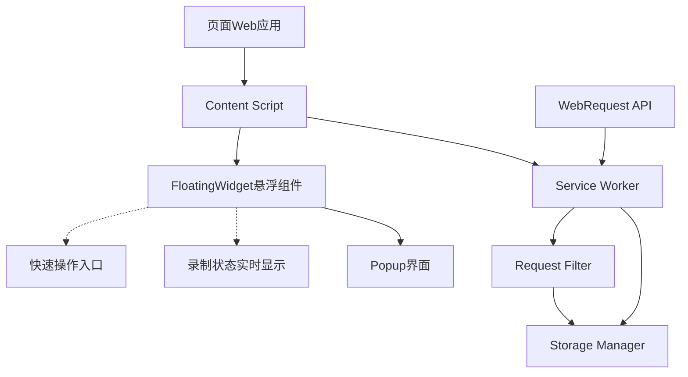
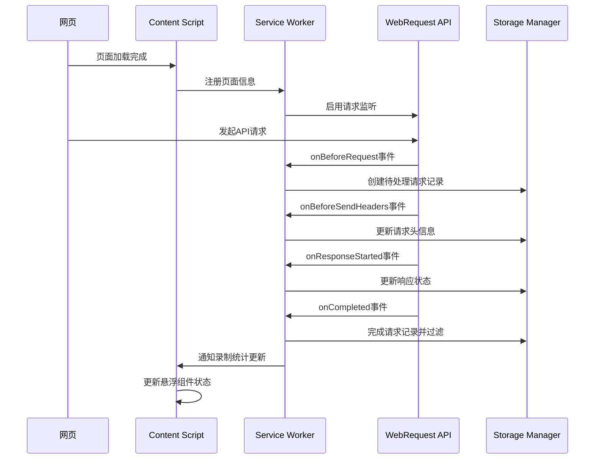
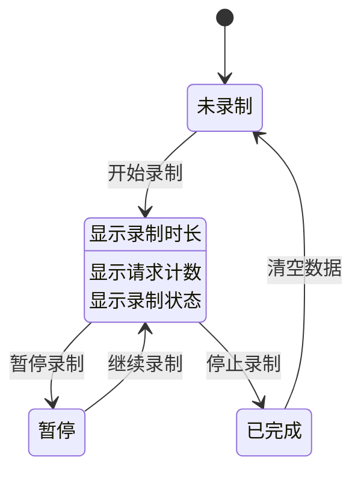

# Chrome扩展API录制功能优化设计

## 概述

本设计文档针对Chrome扩展API录制插件的两个核心问题进行优化：
1. **网络请求录制失效问题** - 插件启动录制后无法成功捕获页面API请求
2. **录制状态可视化缺失** - 缺少录制过程中的实时状态提示和操作入口

优化目标是构建一个稳定可靠的API录制系统，提供直观的录制状态反馈和便捷的用户交互界面。

## 技术架构

### 核心组件交互架构

### 请求捕获流程优化

## 问题分析与解决方案

### 问题一：网络请求录制失效

**根本原因分析：**
1. **请求ID不匹配** - Service Worker中使用自生成ID，与Chrome WebRequest API的requestId不对应
2. **权限不足** - Content Script无法直接访问网络请求数据
3. **过滤逻辑过严** - 某些合法API请求被错误过滤掉

**解决方案：**

#### 请求追踪机制重构
- 使用Chrome原生`requestId`作为唯一标识符，替代自生成ID
- 建立请求生命周期完整追踪链路
- 优化临时存储结构，确保请求数据完整性

#### 权限配置优化
- 确认Manifest V3权限配置正确性
- 增加对HTTPS、HTTP、WebSocket等协议的全面支持
- 优化host_permissions配置覆盖范围

#### 过滤策略调整
- 放宽初始过滤条件，优先保证请求捕获完整性
- 将严格过滤逻辑后置到最终存储阶段
- 增加调试模式，记录被过滤掉的请求信息

### 问题二：录制状态可视化缺失

**需求定义：**
- 录制过程中在页面右上角显示状态悬浮框
- 实时显示录制时长、捕获请求数量等关键指标
- 提供快速打开插件弹窗的操作入口
- 支持悬浮框的拖拽移动和状态切换

**解决方案架构：**

#### 悬浮组件设计
| 组件属性 | 设计规范 |
|---------|---------|
| 位置策略 | 固定在视口右上角，距离边缘20px |
| 尺寸规格 | 紧凑模式：120x40px，展开模式：180x80px |
| 层级管理 | z-index: 999999，确保在所有页面元素之上 |
| 视觉样式 | 半透明背景，圆角设计，微投影效果 |
| 交互行为 | 点击切换展开/收起，双击打开插件弹窗 |

#### 状态数据同步

## 优化后的组件架构

### Content Script增强
**新增功能模块：**
- **FloatingWidget管理器** - 负责悬浮组件的创建、显示和交互
- **状态同步器** - 实时同步Service Worker的录制状态
- **页面注入器** - 安全地将悬浮组件注入到目标页面

### Service Worker改进
**核心优化点：**
- **请求追踪优化** - 使用标准requestId，完善请求生命周期管理
- **实时通信** - 建立与Content Script的双向通信机制
- **性能监控** - 增加请求处理性能指标收集

### 存储层优化
**数据结构改进：**
- 优化临时请求存储结构，支持requestId索引
- 增加录制会话的实时统计数据
- 实现请求数据的增量更新机制

## 悬浮组件详细设计

### 界面状态定义

| 状态 | 显示内容 | 交互行为 |
|------|---------|---------|
| 未录制 | "点击开始录制" 提示 | 点击启动录制 |
| 录制中 | 录制时长 + 请求计数 | 点击展开详情 |
| 已暂停 | 暂停图标 + 统计信息 | 点击继续录制 |
| 录制完成 | 完成图标 + 总计数据 | 点击查看结果 |

### 数据展示规则

**时长格式化：**
- 00:00-59:59 显示为 "分:秒"
- 1小时以上显示为 "时:分:秒"

**请求计数显示：**
- 小于100：直接显示数字
- 100-999：显示为 "100+"
- 1000以上：显示为 "1K+"

### 响应式适配

| 视口宽度 | 悬浮框位置调整 |
|---------|---------------|
| < 768px | 自动收起为小图标模式 |
| 768px-1024px | 标准模式显示 |
| > 1024px | 完整模式，支持更多信息展示 |

## 通信协议设计

### 消息类型扩展

| 消息类型 | 发送方 | 接收方 | 数据结构 |
|---------|-------|--------|---------|
| RECORDING_STATUS_CHANGED | Service Worker | Content Script | `{isRecording, recordCount, duration}` |
| TOGGLE_RECORDING | Content Script | Service Worker | `{action: 'start' \| 'stop' \| 'pause'}` |
| OPEN_POPUP | Content Script | Service Worker | `{}` |
| UPDATE_FLOATING_WIDGET | Service Worker | Content Script | `{visible, data}` |

### 状态同步机制
- Service Worker变更录制状态时主动推送通知
- Content Script每5秒轮询一次状态确保同步
- 页面切换时重新建立通信连接

## 测试策略

### 功能测试场景

**请求捕获测试：**
1. 标准RESTful API请求（GET、POST、PUT、DELETE）
2. 带认证头的请求（Bearer Token、Cookie等）
3. 表单数据提交（FormData、JSON）
4. 文件上传请求
5. WebSocket连接建立
6. 跨域CORS请求

**悬浮组件测试：**
1. 不同页面环境下的显示兼容性
2. 页面滚动时的位置固定效果
3. 与页面元素的层级冲突处理
4. 移动端响应式适配
5. 长时间录制的性能表现

### 兼容性验证

| 浏览器版本 | 测试重点 |
|-----------|---------|
| Chrome 88+ | 基础功能完整性 |
| Chrome 100+ | Manifest V3特性支持 |
| Edge 88+ | 跨浏览器兼容性 |
| 移动Chrome | 触摸交互优化 |

## 性能优化策略

### 内存管理
- 限制同时处理的最大请求数量（默认1000个）
- 实现请求数据的分页存储和延迟加载
- 定期清理过期的临时数据

### 通信效率
- 使用事件驱动的消息机制，避免轮询
- 压缩传输的状态数据，减少序列化开销
- 建立消息优先级队列，确保重要状态及时更新

### 用户界面响应
- 悬浮组件使用CSS3硬件加速
- 状态更新采用防抖机制，避免频繁重绘
- 长列表使用虚拟滚动技术

## 安全考虑

### 数据隔离
- 确保录制数据仅在当前会话有效
- 实现敏感信息（密码、Token）的自动脱敏
- 建立数据访问权限控制机制

### 内容安全策略
- 悬浮组件不执行任何外部脚本
- 使用CSP兼容的样式注入方式
- 防止XSS攻击和代码注入

## 用户体验优化

### 交互友好性
- 首次使用时提供操作引导
- 支持键盘快捷键操作（Ctrl+R开始/停止录制）
- 提供操作撤销和数据恢复功能

### 状态反馈
- 操作成功/失败的及时通知
- 长时间操作的进度指示
- 异常情况的友好错误提示

### 个性化配置
- 悬浮组件位置记忆功能
- 录制过滤规则的用户自定义
- 界面主题和透明度调节